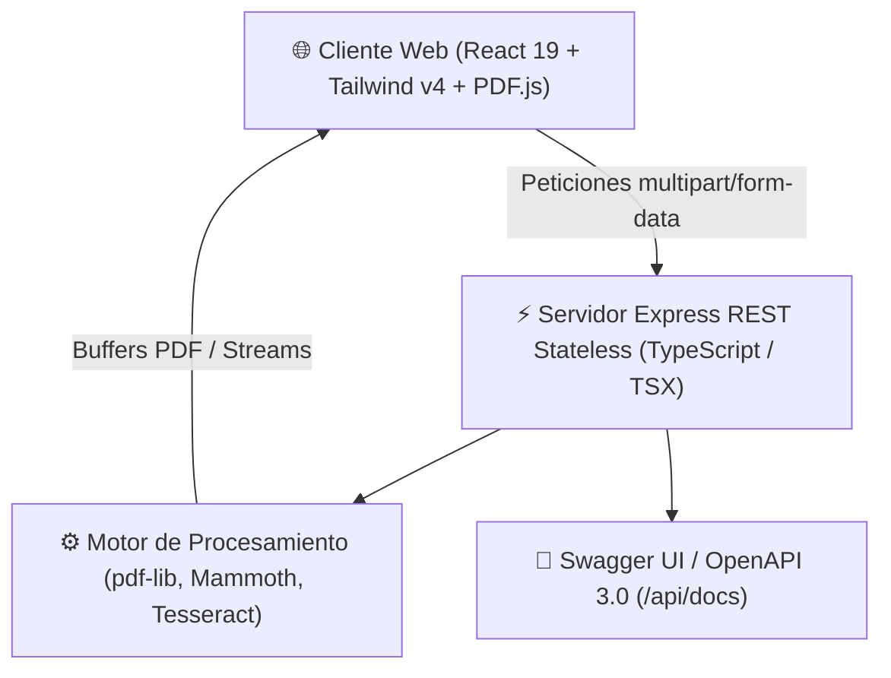

# 📑 PDF Professional Studio

> **Autor:** Owen Badel Hooker — Ingeniero de Sistemas / Software Architect  
> **Versión:** 1.0.0 — Listo para Producción  
> **Licencia:** Propietaria / Confidencial  

---

## 🎯 Descripción General
**PDF Professional Studio** es una plataforma integral de alto rendimiento para la manipulación, edición, transformación y optimización de documentos PDF. Combina una interfaz gráfica moderna, táctil e intuitiva desarrollada en **React 19** y **TailwindCSS v4**, con un motor de backend stateless en **Express** y **pdf-lib** capaz de ejecutar operaciones pesadas de unión, división por rangos, compresión equilibrada, conversión multiformato y reconocimiento óptico de caracteres (OCR).

---

## ✨ Características Principales

### 🖥️ 1. Editor Visual e Interactivo (Frontend)
- **Lienzo de Alta Fidelidad:** Visualización de PDFs con renderizado continuo mediante PDF.js.
- **Herramientas de Anotación:**
  - ✏️ **Lápiz y Trazo Libre:** Dibujo sobre cualquier página con selección de colores y grosores.
  - 🖍️ **Resaltador de Texto:** Subrayado translúcido de precisión.
  - 📝 **Anotaciones de Texto Directo:** Creación, edición inline y posicionamiento arrastrable.
  - 🖋️ **Firmas e Imágenes:** Carga de firmas en PNG/JPG, ajuste de escala y movimiento en tiempo real.
- **Historial Completo:** Soporte de Deshacer (Undo) y Rehacer (Redo).
- **Tema Claro / Oscuro Dinámico:** Persistencia automática en `localStorage` y adaptación ergonómica.

### ⚡ 2. Operaciones Pesadas y Microservicios REST (Backend)
- **Unir PDFs (`POST /api/pdf/merge`):** Consolidación atómica de hasta 20 documentos en un solo PDF.
- **Dividir PDF (`POST /api/pdf/split`):** Extracción de páginas por rangos individuales o continuos con descarga en PDF único o ZIP.
- **Comprimir PDF (`POST /api/pdf/compress`):** Optimización y remoción de flujos redundantes con niveles `low`, `medium` y `high`.
- **Convertir a Imágenes (`POST /api/pdf/to-image`):** Exportación de páginas en alta resolución (PNG/JPG).
- **OCR con Inteligencia Visual (`POST /api/pdf/ocr`):** Extracción automatizada de texto impreso y escaneado con Tesseract.js.
- **Conversión de Documentos (`POST /api/pdf/convert`):** Conversión directa de imágenes (JPG, PNG, WebP) y documentos Word (.docx) a formato PDF estándar.
- **Documentación Interactiva Swagger UI (`GET /api/docs`):** Playground interactivo para probar los endpoints en vivo.

---

## 🏛️ Arquitectura del Sistema



---

## 🔒 Seguridad y Buenas Prácticas de Producción
1. **Límites de Carga:** Protección contra sobrecarga mediante límite de 20MB por archivo en peticiones multipart.
2. **Validación Estricta de Tipos MIME:** Verificación de extensiones y firmas de archivo autorizadas.
3. **Limpieza Reactiva de Archivos Temporales:** Destrucción automática de archivos en disco inmediatamente después de emitir la respuesta HTTP (`res.on('finish')`).
4. **Cero Retención de Datos:** Arquitectura completamente stateless que garantiza la privacidad total del usuario.
5. **Cabeceras de Seguridad:** Configuración de cabeceras HTTP restrictivas y CORS granular.

---

## 🚀 Puesta en Marcha Local

### Prerrequisitos
- **Node.js:** Versión 18 o superior.
- **NPM** o **Bun**.

### Instalación y Ejecución
```bash
# 1. Instalar dependencias
npm install

# 2. Iniciar servidor de desarrollo unificado (API + Vite Frontend)
npm run dev

# 3. Compilar para producción
npm run build

# 4. Iniciar servidor de producción
npm start
```

La aplicación estará disponible de inmediato en `http://localhost:3000`.  
Para explorar la API REST, accede a `http://localhost:3000/api/docs`.
